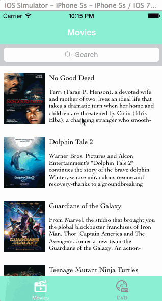

Rotten-Tomatoes
===============

Display box office movies and top rental DVDs using the [Rotten Tomatoes API](http://developer.rottentomatoes.com/docs/read/JSON)

Time spent: 15 hours spent in total

Completed user stories:
 * [x] Required: User can view a list of movies from Rotten Tomatoes. Poster images must be loading asynchronously.
 * [x] Required: User can view movie details by tapping on a cell.
 * [x] Required: User sees loading state while waiting for movies API.
 * [x] Required: User sees error message when there's a networking error.
 * [x] Required: User can view a list of movies from Rotten Tomatoes. Poster images must be loading asynchronously.
 * [x] Required: User can view movie details by tapping on a cell.
 * [x] Required: User can pull to refresh the movie list.
 
 * [x] Optional: All images fade in.
 * [x] Optional: For the large poster, load the low-res image first, switch to high-res when complete.
 * [x] Optional: All images should be cached in memory and disk. In other words, images load immediately upon cold start.
 * [x] Optional: Customize the highlight and selection effect of the cell.
 * [x] Optional: Customize the navigation bar.
 * [x] Optional: Add a tab bar for Box Office and DVD.
 * [x] Optional: Add a search bar.

Additional user stories:
 * [x] Additional: Blur the movie poster when user click the movie details.
 * [x] Additional: Add spring animation when user click the movie details.

 
Walkthrough of all user stories:

GIF created with [LiceCap](http://www.cockos.com/licecap/).

## Acknowledge

This app leverages several third-party libraries:

 * [MMProgressHUD](https://github.com/mutualmobile/MMProgressHUD).

 * FaceBook [POP](https://github.com/facebook/pop).
 
 * [TSMessages](https://github.com/toursprung/TSMessages).

 * [AFNetworking](https://github.com/AFNetworking/AFNetworking).
